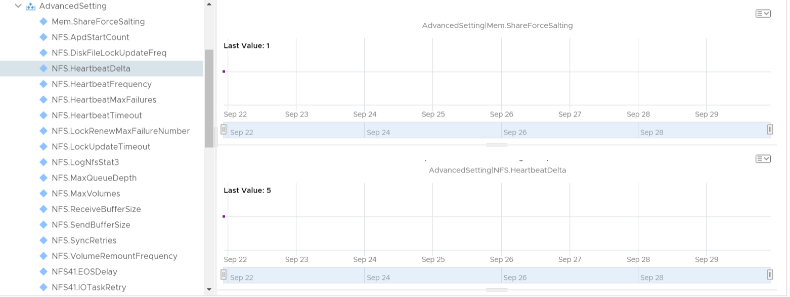

# Advanced Setting Properties

Script will collect VUM Baseline attached to each host in a vSphere cluster and assign Baseline name and compliance state to the associated object in vROps.

### Requires existing connection to vCenter server

### Script Parameters

    $vROpsHost = vROPs Hostname
    $vROpsCred = Credential object with rights in vROps to add data to objects and access API.
    $cluster = vSphere cluster to evaluate.
    $Setting = Advanced setting to retrieve from hosts in cluster
    $SettingList = path to JSON file of containing list of properties to retrieve from hosts.

    **NOTE** It is highly recommended to only import the advanced settings that you require to report on in vROps. By adding all possible settings can cause significant performance degradation of vROps.

### Sample Data

