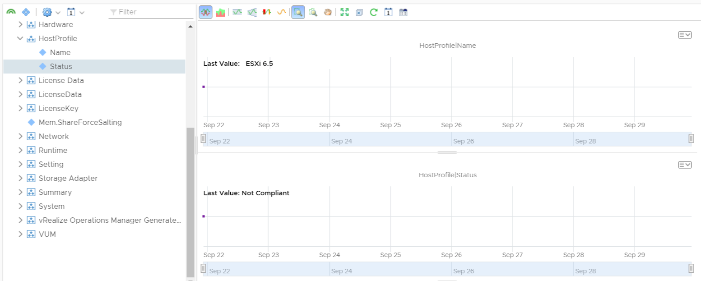

# Host Profile Properties

Script will collect compliance of specified Host Profile for host and update the associated object in vROps.

### Requires existing connection to vCenter server

### Script Parameters

    $vROpsHost = vROPs Hostname
    $vROpsCred = Credential object with rights in vROps to add data to objects and access API.
    $cluster = vSphere cluster to evaluate.

### Sample Data

