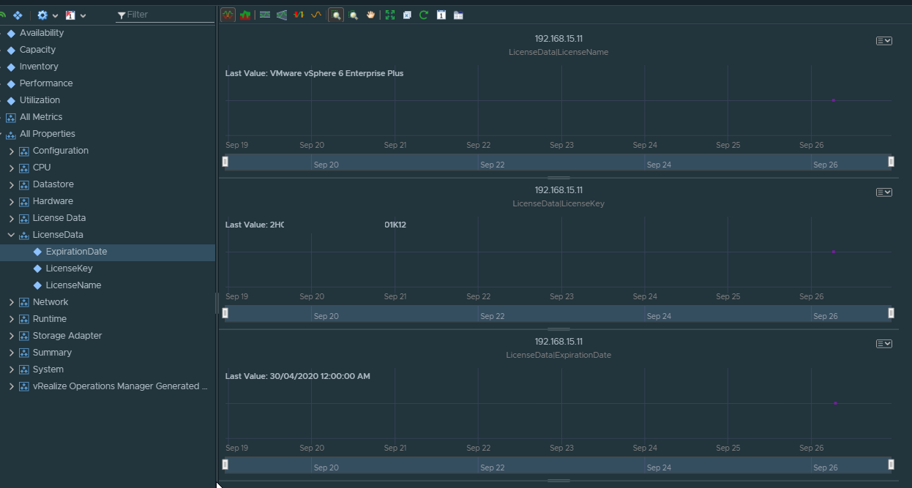

# Licence Key Properties

Script will collect vCenter Licence Key data and add to associated vROps Objects.

### Script Parameters

    $vROpsHost = vROPs Hostname
    $vROpsCred = Credential object with rights in vROps to add data to objects and access API.

### Sample Data

