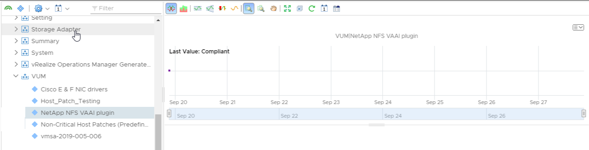

# VUM Properties

Script will collect VUM Baseline attached to each host in a vSphere cluster and assign Baseline name and compliance state to the associated object in vROps.

### Requires existing connection to vCenter server

### Script Parameters

    $vROpsHost = vROPs Hostname
    $vROpsCred = Credential object with rights in vROps to add data to objects and access API.
    $baseline = VUM Baseline to validate.
    $cluster = vSphere cluster to evaluate.

### Sample Data

